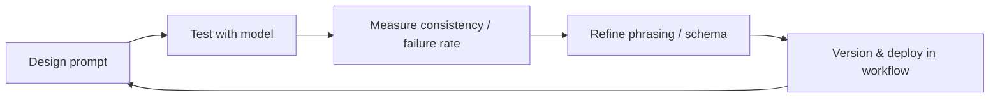

- Prompt engineering is transitioning is moving towards **interface design** — defining how humans control AI through text.
- The book *O’Reilly’s “Future-Proof Inputs”*, shows **reliable prompts**: explicit inputs, minimal ambiguity, and measurable outputs.
- AI won’t replace engineers; engineers using AI will.
- Prompts are more similar to **language protocols**, that to magic spells — design, test, and version them.

---

### The importance of prompt engineering

The rise of large language models (LLMs) has shifted the interaction design from buttons to natural language. For us (I mean engineers), a prompt is one of the **primary interfaces** to AI systems.  

This transformation matters because **language has become the new control layer** — yet it remains largely invisible, inconsistent, and untested (shout out for the QAs). Formalizing prompt engineering bridges human intent and model behavior with the same rigor once was applied to UI and API design.

As models integrate deeper into workflows (coding, research, product design), prompt design directly affects reproducibility, fairness, latency, and even cost. Reliable prompting isn’t about clever or magical phrasing — it’s about building **structured, testable interfaces** between humans and probabilistic systems.

---

### Some Background 

1. Early prompt engineering (circa 2020–2022) was heuristic-driven — trial, error, and folklore.  
2. By 2024, model providers began publishing *prompt reliability guidelines* (OpenAI, Anthropic, O’Reilly).  
3. These converged around clarity, grounding, and structure — the same foundations of good UX and software engineering.  
4. As models gained multimodal inputs and function-calling, prompts became **orchestrators**, not just text.  
5. In 2025, teams now treat prompts as **production assets**, version-controlled and evaluated like code.

---

### The most recent Interface Design for Probabilistic Systems

We can define prompt engineering as how **humans try to map language for model behavior**.  
Unlike deterministic UIs, LLMs can interpret ambiguity — so precision must shift from syntax to semantics.

A 'good' prompt could be:

```text
You are a senior QA engineer. 
Analyze this code and produce a test plan with steps, edge cases, and pass/fail conditions.
Return valid JSON: { "tests": [...], "summary": "..." }
````

This example demonstrates **role, task, constraints and format**.

| Prompt Component | Purpose                            |
| ---------------- | ---------------------------------- |
| Role definition  | Sets context, tone, responsibility |
| Task definition  | Defines clear intent               |
| Constraints      | Ensures predictable structure      |
| Output format    | Enables parsing and testing        |

---

### Principles from “Future-Proof Inputs” (O’Reilly, 2024)

O’Reilly’s *Prompt Engineering for Reliable AI Outputs* outlines five durable principles that mirror robust software design:

1. **Determinism** — phrasing should reduce variance, not charm the model.
2. **State awareness** — carry forward relevant context only; reset often.
3. **Explicit schema** — outputs should follow testable structures (JSON, tables, Markdown).
4. **Instructional hierarchy** — separate meta-instructions (role, tone) from task instructions.
5. **Observability** — log prompts, versions, tokens, and failure rates.

Together, these create **prompt contracts** — behavioral agreements between human and model.

---

### Prompt Lifecycle

Prompting at scale mirrors software development. Each iteration improves precision and reduces noise.



This loop operationalizes the interface.
Where UX designers run A/B tests, prompt engineers run **consistency@k** or **failure@p95** metrics — evaluating how stable outputs remain across model updates or paraphrased inputs.

---

### It's not magic

Prompt engineering is often misrepresented as finding *magic incantations*.
In practice, high-performing teams formalize prompts like **API contracts**, not charms:

| Bad Practice                          | Alternative                                                                     |
| ------------------------------------- | ---------------------------------------------------------------------------------------- |
| “Write a brilliant blog post about X” | “Summarize topic X in 4 paragraphs; include 2 factual references and 1 counterargument.” |
| “Pretend you’re a genius coder”       | “You are a senior engineer; produce idiomatic Python 3.11 code with docstrings.”         |
| “Do this step by step”                | “Enumerate steps in order; prefix each with Step N: for easy parsing.”                   |

By enforcing **consistency through constraint**, not creativity, prompts become **predictable components** — composable, testable, and replaceable.

---

### AI won’t take your job. People who know how to use it will.

The productivity between ad-hoc users and structured prompt designers is widening.
For engineers, prompt literacy compounds in two ways:

1. **Time leverage:** fewer retries impacts on faster iteration.
2. **Cognitive leverage:** clearer task framing is related to higher-quality outputs.

Prompt engineering doesn’t replace programming; it extends it — adding a **semantic control layer** atop probabilistic computation. (This also applies to all areas within tech, QAs, BAs, even project managers lol)

To sum up, AI won’t take your job. People who know how to use it will. So please, be one of them.

---

### References

* O’Reilly Media — *Prompt Engineering for Reliable AI Outputs: Future-Proof Inputs* (2024).
* OpenAI Cookbook — *Evaluating LLM Output Consistency* (2024).
* Anthropic — *Constitutional AI and Prompt Robustness* (2023).
* Microsoft Research — *Grounded Generation Framework* (2024).
* HuggingFace — *PromptSource Repository* (open dataset for prompt templates).

