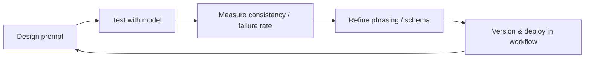

- Prompt engineering is transitioning from “craft” to **interface design** — defining how humans control AI through text.
- The best practices echo UX design: clarity, consistency, and predictability over cleverness.
- Following *O’Reilly’s “Future-Proof Inputs”* framework, **reliable prompts** share traits with robust APIs: explicit inputs, minimal ambiguity, and measurable outputs.
- AI won’t replace engineers; engineers using structured prompting will outperform those who don’t.
- Treat prompts as **language protocols**, not magic spells — design, test, and version them.

---

## Why It Matters

The rise of large language models (LLMs) has shifted interaction design from buttons and forms to natural language. For engineers, founders, and researchers, the prompt is now the **primary interface** to AI systems.  
This transformation matters because **language has become the new control layer** — yet it remains largely invisible, inconsistent, and untested. Formalizing prompt engineering bridges human intent and model behavior with the same rigor once applied to UI and API design.

As models integrate deeper into workflows (coding, research, product design), prompt design directly affects reproducibility, fairness, latency, and even cost. Reliable prompting isn’t about clever phrasing — it’s about building **structured, testable interfaces** between humans and probabilistic systems.

---

#### Some Background 

1. Early prompt engineering (circa 2020–2022) was heuristic-driven — trial, error, and folklore.  
2. By 2024, model providers began publishing *prompt reliability guidelines* (OpenAI, Anthropic, O’Reilly).  
3. These converged around clarity, grounding, and structure — the same foundations of good UX and software engineering.  
4. As models gained multimodal inputs and function-calling, prompts became **orchestrators**, not just text.  
5. In 2025, teams now treat prompts as **production assets**, version-controlled and evaluated like code.

---

### 1. Prompt Engineering = Interface Design for Probabilistic Systems

Prompt engineering defines how **human intent maps to model behavior**.  
Unlike deterministic UIs, LLMs interpret ambiguity — so precision must shift from syntax to semantics.

A reliable prompt:
```text
You are a senior QA engineer. 
Analyze this code and produce a test plan with steps, edge cases, and pass/fail conditions.
Return valid JSON: { "tests": [...], "summary": "..." }
````

This example demonstrates **role → task → constraints → format** — the four primitives of reproducible prompting.

| Prompt Component | Analogy in Traditional UX | Purpose                            |
| ---------------- | ------------------------- | ---------------------------------- |
| Role definition  | System persona            | Sets context, tone, responsibility |
| Task definition  | Button label              | Defines clear intent               |
| Constraints      | Form validation           | Ensures predictable structure      |
| Output format    | API schema                | Enables parsing and testing        |

---

### 2. Principles from “Future-Proof Inputs” (O’Reilly, 2024)

O’Reilly’s *Prompt Engineering for Reliable AI Outputs* outlines five durable principles that mirror robust software design:

1. **Determinism over style** — phrasing should reduce variance, not charm the model.
2. **State awareness** — carry forward relevant context only; reset often.
3. **Explicit schema** — outputs should follow testable structures (JSON, tables, Markdown).
4. **Instructional hierarchy** — separate meta-instructions (role, tone) from task instructions.
5. **Observability** — log prompts, versions, tokens, and failure rates.

Together, these create **prompt contracts** — behavioral agreements between human and model.

---

### 3. Prompt Lifecycle: Design → Evaluate → Iterate

Prompting at scale mirrors software development. Each iteration improves precision and reduces noise.



This loop operationalizes the “invisible interface.”
Where UX designers run A/B tests, prompt engineers run **consistency@k** or **failure@p95** metrics — evaluating how stable outputs remain across model updates or paraphrased inputs.

---

### 4. Why It’s Not About “Tricking” the Model

Prompt engineering is often misrepresented as finding *magic incantations*.
In practice, high-performing teams formalize prompts like **API contracts**, not charms:

| Bad Practice                          | Reliable Alternative                                                                     |
| ------------------------------------- | ---------------------------------------------------------------------------------------- |
| “Write a brilliant blog post about X” | “Summarize topic X in 4 paragraphs; include 2 factual references and 1 counterargument.” |
| “Pretend you’re a genius coder”       | “You are a senior engineer; produce idiomatic Python 3.11 code with docstrings.”         |
| “Do this step by step”                | “Enumerate steps in order; prefix each with Step N: for easy parsing.”                   |

By enforcing **consistency through constraint**, not creativity, prompts become **predictable components** — composable, testable, and replaceable.

---

### 5. Prompt Engineering as a Force Multiplier, Not a Job Threat

> “AI won’t take your job. People who know how to use AI effectively will.”

The productivity delta between ad-hoc users and structured prompt designers is widening.
For engineers, prompt literacy compounds in three ways:

1. **Time leverage:** fewer retries → faster iteration.
2. **Cognitive leverage:** clearer task framing → higher-quality outputs.
3. **Economic leverage:** predictable outputs → automation-ready pipelines.

Prompt engineering doesn’t replace programming; it extends it — adding a **semantic control layer** atop probabilistic computation.

---

## Trade-offs & Failure Modes

| Risk            | Cause                                  | Mitigation                                          |
| --------------- | -------------------------------------- | --------------------------------------------------- |
| Model drift     | Updates alter responses                | Maintain regression datasets; monitor consistency@k |
| Overfitting     | Prompts too tailored to a single model | Test across providers (OpenAI, Anthropic, Gemini)   |
| Latency cost    | Complex prompts increase token count   | Benchmark prompt length vs. accuracy                |
| Hidden bias     | Role framing alters tone or judgment   | Rotate roles and measure semantic variance          |
| Human overtrust | “It sounds right” fallacy              | Enforce validation and secondary checks             |


---

## Related Work & References

* O’Reilly Media — *Prompt Engineering for Reliable AI Outputs: Future-Proof Inputs* (2024).
* OpenAI Cookbook — *Evaluating LLM Output Consistency* (2024).
* Anthropic — *Constitutional AI and Prompt Robustness* (2023).
* Microsoft Research — *Grounded Generation Framework* (2024).
* HuggingFace — *PromptSource Repository* (open dataset for prompt templates).

