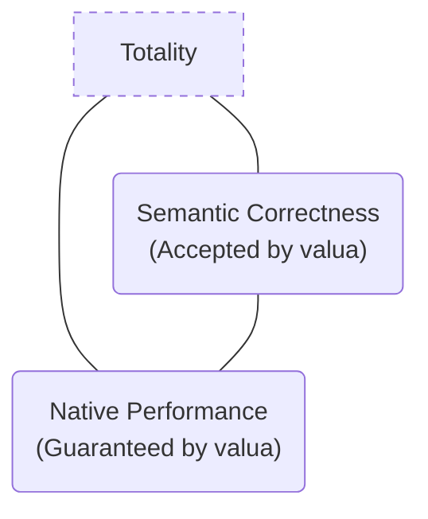
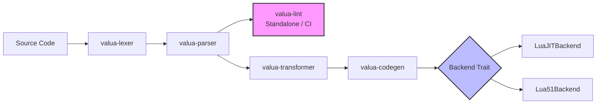

The Lua ecosystem suffers from a profound structural disconnection: developers building critical infrastructure in production—ranging from Neovim plugins and embedded environments to high-throughput fintech gateways and API proxies like OpenResty or Kong—are shackled to the syntax and semantics of Lua 5.1 due to the irreplaceable performance superiority of the LuaJIT trace compiler. Meanwhile, the language evolves independently under PUC-Rio, introducing modern and highly necessary design primitives in versions 5.4 and 5.5, such as variable attributes (`<const>`, `<close>`), native bitwise operators, compact arrays, and dual-number systems.

To resolve this fragmentation without sacrificing native runtime performance, we introduce **valua**: a source-to-source transpiler and linter written in Rust that compiles modern Lua 5.5 source code into equivalent, cleanly executable Lua 5.1 code optimized for LuaJIT.

---

## The Unsolvable Trilemma and Design by Constraint

The engineering of `valua` does not start from a naive assumption of absolute compatibility. There is a formally proven theoretical constraint defining the rules of the game: **it is mathematically impossible to build a modern Lua to LuaJIT transpiler that is simultaneously total, semantically correct, and capable of preserving native performance.**

This architectural impossibility rests on three structural pillars:

1. **Numerical System Asymmetry:** Lua 5.4+ explicitly differentiates between `integer` and `float` through runtime introspection (`math.type`), whereas LuaJIT collapses both subtypes into a single `number` type (IEEE 754 double precision).
2. **Irreducible Emulation Cost:** Attempting to bridge this distinction by injecting dynamic wrappers on the heap (tables with custom typing metatables) introduces a drastic performance penalty—slowing operations down by 20x to 100x due to allocation overhead and the disruption of the JIT compiler's allocation sinking optimizations.
3. **Undecidability of Static Analysis:** Determining statically whether an arbitrary program will observe or depend on exact 64-bit integer overflows or type distinctions is equivalent to the Halting Problem.

`valua` embraces this trilemma as its foundational architectural principle. Instead of implementing opaque hybrid fallbacks that silently degrade hot-path performance, the compiler **deliberately sacrifices totality**.

The compiler operates as a well-defined partial function:

$$T : L_{5.5}^{\text{native}} \longrightarrow L_J$$

Where the excluded domain is strictly characterized at the syntactic level. If you write pure arithmetic, bitwise manipulations, or optimize memory using modern data structures, the compiler emits clean, direct code that the JIT compiler handles natively at machine-instruction speed. If the source code attempts runtime numerical introspection via `math.type` or introduces edge-case patterns reliant on exact overflow behaviors, the compiler aborts execution immediately. It emits explicit diagnostic codes (`E0101`, `E0102`) showing the exact error span and refactoring suggestions. What you write is what you control.

---

## A Decoupled, Portability-Oriented Architecture

To ensure pipeline robustness and deliver early value in the development workflow, `valua` is structured as a modular Rust workspace, decoupling its core responsibilities into autonomous, public crates:

### 1. `valua-lint` — Standalone Static Analysis

Unlike conventional compilers where semantic validation is tightly coupled to the code generator, `valua`’s linter is a public, standalone component. Exposing its own CLI (`valua lint`), it can be integrated directly into CI/CD pipelines, pre-commit hooks, or LSP environments without invoking code transformations or emitting output files. It validates invalid mutations of `<const>` variables and raises cross-platform portability alerts early, stripping away adoption friction from day one.

### 2. Trait-Driven Code Generation via `Backend`

The `valua-codegen` crate does not rely on a monolithic emitter. Instead, the generation engine abstracts the lexical and structural capabilities of the target output through a generic `Backend` trait:

* **`LuaJITBackend`:** Maps Lua 5.5 bitwise operators directly to native `bit` library calls, allowing the trace compiler to optimize them fully without interpreter overhead.
* **`Lua51Backend` (PUC-Rio):** Detects environments lacking native bitwise support and dynamically injects isolated fallback primitives (`BITWISE_FALLBACK`) only within modules where they are required, completely suppressing dead-code bloat.

This modularity decouples the Abstract Syntax Tree (AST) from the target output syntax, cleanly positioning the architecture to support future backends like Luau or Teal without core refactoring.

### 3. Forward Syntactic Tolerance Principle

The lexer and parser are not rigidly anchored to the rigid boundaries of the Lua 5.5 specification. Instead, they implement the complete syntactic union of grammars from Lua 5.1 onward, utilizing heuristic tolerances designed to accept future token specifications without rewriting the core parsing engine. Adapting to or transforming newer language specifications is achieved purely by stacking additive passes within the `valua-transformer` crate, ensuring long-term architectural resilience.

---

## Compiler Performance and Conformity
## Closing Lua's Generational Fracture: Introducing valua

The Lua ecosystem suffers from a profound structural disconnection: developers building critical infrastructure in production—ranging from Neovim plugins and embedded environments to high-throughput fintech gateways and API proxies like OpenResty or Kong—are shackled to the syntax and semantics of Lua 5.1 due to the irreplaceable performance superiority of the LuaJIT trace compiler. Meanwhile, the language evolves independently under PUC-Rio, introducing modern and highly necessary design primitives in versions 5.4 and 5.5, such as variable attributes (`<const>`, `<close>`), native bitwise operators, compact arrays, and dual-number systems.

To resolve this fragmentation without sacrificing native runtime performance, we introduce **valua**: a source-to-source transpiler and linter written in Rust that compiles modern Lua 5.5 source code into equivalent, cleanly executable Lua 5.1 code optimized for LuaJIT.

---

## The Unsolvable Trilemma and Design by Constraint

The engineering of `valua` does not start from a naive assumption of absolute compatibility. There is a formally proven theoretical constraint defining the rules of the game: **it is mathematically impossible to build a modern Lua to LuaJIT transpiler that is simultaneously total, semantically correct, and capable of preserving native performance.**

This architectural impossibility rests on three structural pillars:

1. **Numerical System Asymmetry:** Lua 5.4+ explicitly differentiates between `integer` and `float` through runtime introspection (`math.type`), whereas LuaJIT collapses both subtypes into a single `number` type (IEEE 754 double precision).
2. **Irreducible Emulation Cost:** Attempting to bridge this distinction by injecting dynamic wrappers on the heap (tables with custom typing metatables) introduces a drastic performance penalty—slowing operations down by 20x to 100x due to allocation overhead and the disruption of the JIT compiler's allocation sinking optimizations.
3. **Undecidability of Static Analysis:** Determining statically whether an arbitrary program will observe or depend on exact 64-bit integer overflows or type distinctions is equivalent to the Halting Problem.

`valua` embraces this trilemma as its foundational architectural principle. Instead of implementing opaque hybrid fallbacks that silently degrade hot-path performance, the compiler **deliberately sacrifices totality**.

The compiler operates as a well-defined partial function:

$$T : L_{5.5}^{\text{native}} \longrightarrow L_J$$

Where the excluded domain is strictly characterized at the syntactic level. If you write pure arithmetic, bitwise manipulations, or optimize memory using modern data structures, the compiler emits clean, direct code that the JIT compiler handles natively at machine-instruction speed. If the source code attempts runtime numerical introspection via `math.type` or introduces edge-case patterns reliant on exact overflow behaviors, the compiler aborts execution immediately. It emits explicit diagnostic codes (`E0101`, `E0102`) showing the exact error span and refactoring suggestions. What you write is what you control.

---

## A Decoupled, Portability-Oriented Architecture

To ensure pipeline robustness and deliver early value in the development workflow, `valua` is structured as a modular Rust workspace, decoupling its core responsibilities into autonomous, public crates:

### 1. `valua-lint` — Standalone Static Analysis

Unlike conventional compilers where semantic validation is tightly coupled to the code generator, `valua`’s linter is a public, standalone component. Exposing its own CLI (`valua lint`), it can be integrated directly into CI/CD pipelines, pre-commit hooks, or LSP environments without invoking code transformations or emitting output files. It validates invalid mutations of `<const>` variables and raises cross-platform portability alerts early, stripping away adoption friction from day one.

### 2. Trait-Driven Code Generation via `Backend`

The `valua-codegen` crate does not rely on a monolithic emitter. Instead, the generation engine abstracts the lexical and structural capabilities of the target output through a generic `Backend` trait:

* **`LuaJITBackend`:** Maps Lua 5.5 bitwise operators directly to native `bit` library calls, allowing the trace compiler to optimize them fully without interpreter overhead.
* **`Lua51Backend` (PUC-Rio):** Detects environments lacking native bitwise support and dynamically injects isolated fallback primitives (`BITWISE_FALLBACK`) only within modules where they are required, completely suppressing dead-code bloat.

This modularity decouples the Abstract Syntax Tree (AST) from the target output syntax, cleanly positioning the architecture to support future backends like Luau or Teal without core refactoring.

### 3. Forward Syntactic Tolerance Principle

The lexer and parser are not rigidly anchored to the rigid boundaries of the Lua 5.5 specification. Instead, they implement the complete syntactic union of grammars from Lua 5.1 onward, utilizing heuristic tolerances designed to accept future token specifications without rewriting the core parsing engine. Adapting to or transforming newer language specifications is achieved purely by stacking additive passes within the `valua-transformer` crate, ensuring long-term architectural resilience.

---

## Compiler Performance and Conformity

Engineered under high-performance systems paradigms, the compiler satisfies strict operational metrics tailored for modern development toolchains:

* **Compiler Throughput:** Compilation throughput reaches a minimum baseline of **100k lines per second** on standard commodity hardware, maintaining an ultra-low cold-start latency under 50ms for single-script evaluations.
* **JIT Preservation:** The generated code for heavier logical abstractions, such as the emulation of the resource-managing `<close>` variable attribute (translated efficiently via scoped, guarded `pcall` patterns), maintains a negligible performance impact in production-grade, I/O-bound environments.

`valua` does not seek to disrupt the ecosystem by introducing an experimental runtime or a competing dialect. It is a piece of technical infrastructure designed to build a deterministic, clean bridge over an industry-wide technical gap. The compiler is available now as a standalone binary and an integrable crate for Rust toolchains.
Engineered under high-performance systems paradigms, the compiler satisfies strict operational metrics tailored for modern development toolchains:

* **Compiler Throughput:** Compilation throughput reaches a minimum baseline of **100k lines per second** on standard commodity hardware, maintaining an ultra-low cold-start latency under 50ms for single-script evaluations.
* **JIT Preservation:** The generated code for heavier logical abstractions, such as the emulation of the resource-managing `<close>` variable attribute (translated efficiently via scoped, guarded `pcall` patterns), maintains a negligible performance impact in production-grade, I/O-bound environments.

`valua` does not seek to disrupt the ecosystem by introducing an experimental runtime or a competing dialect. It is a piece of technical infrastructure designed to build a deterministic, clean bridge over an industry-wide technical gap. The compiler is available now as a standalone binary and an integrable crate for Rust toolchains.